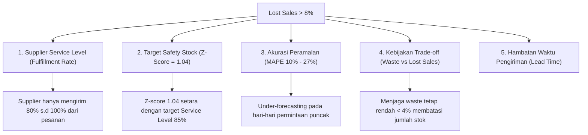

# Laporan Analisis: Mengapa Tingkat Lost Sales Berada di Atas 8%?

Laporan ini disusun untuk menganalisis faktor-faktor penyebab tingkat **Lost Sales** (penjualan yang hilang akibat stok kosong) berada di kisaran **10% – 13%** (di atas target umum 8%) pada hasil simulasi inventory terbaru untuk Toko **T-01 s.d T-10** (Departemen Fruit dan Vegetable).

Sebagai konteks, berikut adalah performa KPI hasil simulasi saat ini:
*   **VEGETABLE**: Lost Sales = **13.57%** | Waste (Buang/Busuk) = **3.91%**
*   **FRUIT**: Lost Sales = **10.59%** | Waste (Buang/Busuk) = **3.93%**

---

## Ringkasan Faktor Utama (Executive Summary)

Tingkat Lost Sales yang berada di atas 8% disebabkan oleh kombinasi beberapa faktor teknis dan operasional yang saling berkaitan di dalam sistem simulasi supply chain:



---

## Analisis Detail Faktor Penyebab

### 1. Keterbatasan Service Level Supplier (Fulfillment Rate)
Di dalam kode simulasi [simulasi_solusi_A.py](file:///d:/program/tesis/Data-Tesis/Data-Tesis/Pemesanan/src/simulasi_solusi_A.py#L204), Service Level Supplier (`SL`) disimulasikan secara acak antara **80% hingga 100%** (rata-rata **90%**):
```python
SL_arr_s[t] = round(np.random.uniform(0.80, 1.00), 2)
```
Artinya, ketika toko melakukan pemesanan (`Order`), supplier secara rata-rata **gagal mengirimkan 10%** dari kuantitas yang diminta toko. 
*   **Dampak**: Pengurangan kuantitas pengiriman secara acak ini langsung memicu terjadinya stockout harian di toko, sehingga menyumbang porsi besar terhadap angka *Lost Sales*.

### 2. Nilai Z-Score untuk Safety Stock Terlalu Rendah (Z = 1.04)
Safety Stock (stok pengaman) dihitung menggunakan Z-Score sebesar **1.04**:
```python
Z_SCOR = 1.04
SS_s = round(Z_SCOR * stdev_s * math.sqrt(lead_time + review_period), 0)
```
Secara statistik (distribusi normal standar):
*   Nilai **Z-Score = 1.04** merepresentasikan target *Cycle Service Level* sebesar **85%**.
*   Artinya, sistem secara sadar menerima probabilitas kehabisan stok (*stockout probability*) sebesar **15%** selama periode siklus pemesanan ulang.
*   **Kesimpulan**: Angka Lost Sales aktual sebesar **10.59% – 13.57%** sangat logis karena target layanan persediaan (*in-stock probability*) yang dipasang memang hanya berkisar di 85%.

### 3. Akurasi Model Peramalan (Forecast Error / MAPE)
Model peramalan (SARIMAX, LSTM, Hybrid) memiliki galat/error (MAPE) berkisar antara **10% hingga 27%**:
*   Pada hari-hari ketika permintaan riil (*Actual Demand*) melonjak melampaui ramalan model (*Under-forecasting*), jumlah stok yang dipesan tidak mencukupi permintaan nyata konsumen.
*   Karena produk segar memiliki waktu pemesanan berkala (*Review Period*) dan tidak bisa secara instan dipasok ulang (*Lead Time*), kelebihan permintaan di hari tersebut langsung dicatat sebagai *Lost Sales*.

### 4. Kebijakan Trade-Off yang Sangat Ketat dengan Waste (Sampah Produk)
Dalam produk segar (*fresh produce*), ada trade-off yang sangat kuat antara **Waste** (kerugian akibat produk busuk/dibuang) dan **Lost Sales** (kerugian akibat kekurangan stok).
*   Jika toko meningkatkan Safety Stock terlalu tinggi untuk menekan Lost Sales di bawah 8%, maka produk yang tidak terjual akan membusuk dan meningkatkan Waste secara drastis.
*   Saat ini, performa **Waste sangat baik (di bawah 4%)**. Hal ini mengindikasikan bahwa manajemen persediaan saat ini cenderung "konservatif" (lebih memilih sedikit kehabisan stok daripada membuang banyak barang busuk).

### 5. Pengaruh Delay Lead Time & Review Period
Beberapa SKU memiliki *Review Period* hingga 7 hari dan *Lead Time* pengiriman. 
*   Apabila terjadi perubahan pola permintaan yang tiba-tiba di tingkat toko selama rentang waktu tunggu tersebut, toko tidak dapat merespons secara instan. Akibatnya, terjadi penumpukan Lost Sales sebelum pesanan berikutnya tiba.

---

## Rekomendasi Solusi untuk Menekan Lost Sales di Bawah 8%

Jika Anda ingin menurunkan Lost Sales hingga di bawah 8% dalam laporan tesis, Anda dapat menyarankan skenario eksperimen berikut ke dosen/kakak pembimbing:

1.  **Meningkatkan Nilai Z-Score (Safety Stock Target)**
    *   Ubah `Z_SCOR` dari **1.04** (~85% service level) menjadi **1.28** (~90% service level) atau **1.65** (~95% service level).
    *   *Catatan*: Langkah ini dipastikan akan menurunkan *Lost Sales*, namun akan ada sedikit kenaikan pada nilai *Waste %*.
2.  **Negosiasi Peningkatan Service Level Supplier**
    *   Dalam kenyataan bisnis, ritel dapat membuat kontrak penalti agar supplier mengirim barang dengan kepatuhan lebih tinggi (misalnya membatasi rentang variasi SL menjadi **95% – 100%**).
3.  **Memperpendek Lead Time atau Review Period**
    *   Mengurangi waktu tunggu pengiriman atau melakukan pemesanan lebih sering (*Review Period* diperkecil) akan membuat toko lebih responsif terhadap fluktuasi permintaan riil.
